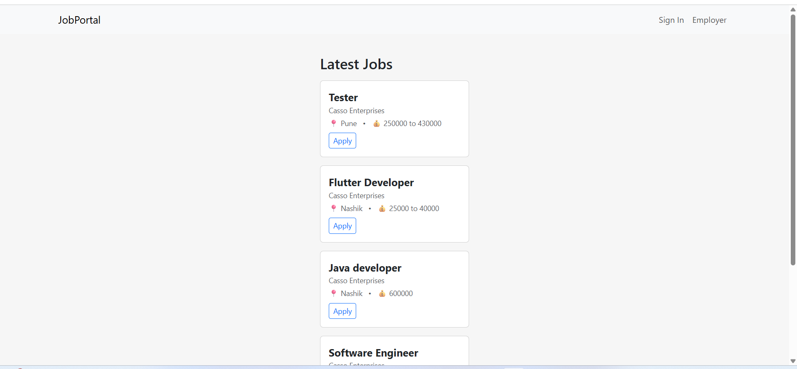
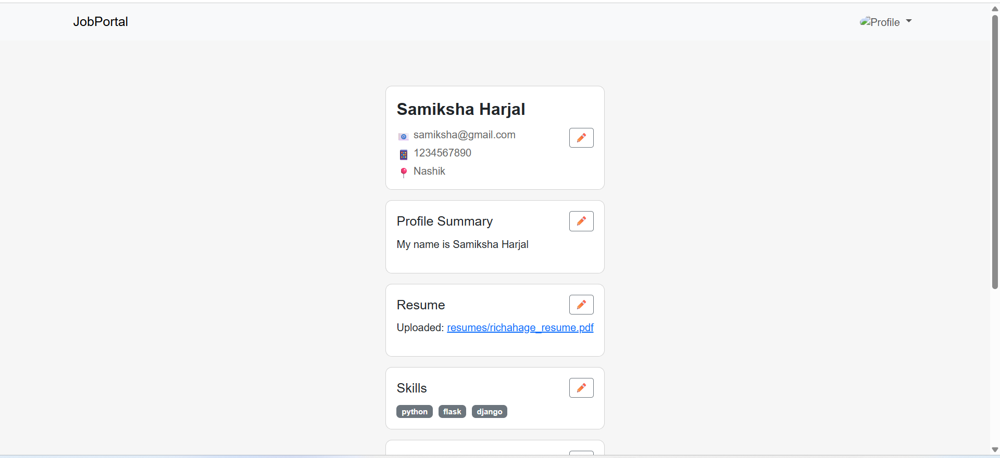
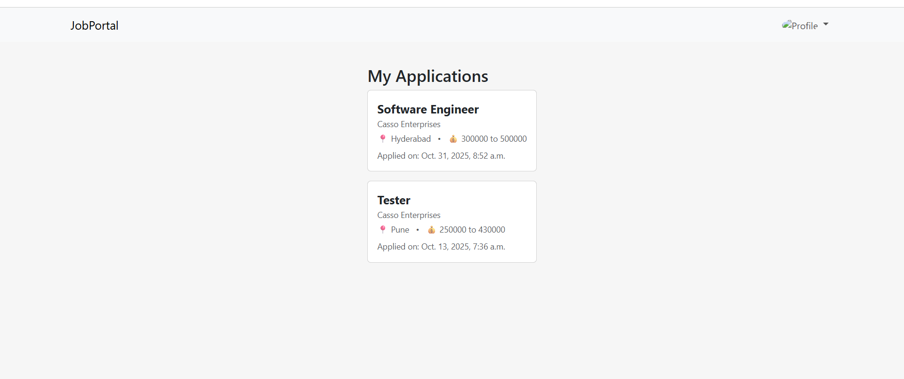
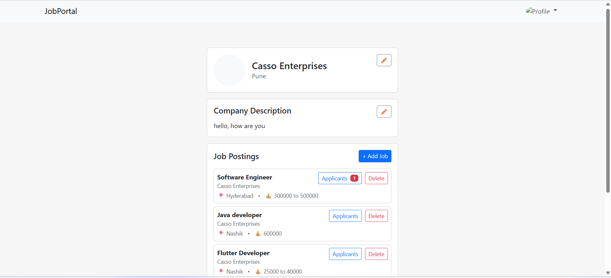
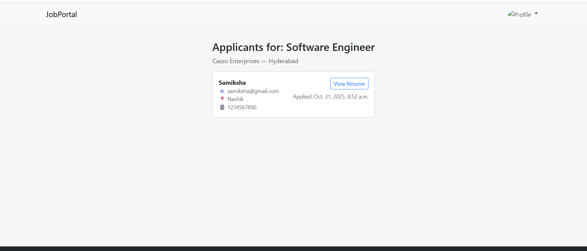

# JobSite – Django Job Portal

A Django-based web platform connecting employers and job seekers.  
Employers can post jobs, and employees can browse and apply for them.

## Features
- Role-based authentication (Employer / Employee)
- Job posting and deletion
- Application tracking
- Employer dashboards
- Responsive Bootstrap UI

## Technologies Used
Python (Django), HTML, CSS, Bootstrap, SQLite

## Project Structure
```
project/
├── accounts/
├── jobs/
├── jobsite
|
├── media/
│
├── templates/
│ ├── base.html
│ ├── accounts/
| ├── includes/
| └── jobs/
│
├── .gitignore
└── manage.py          
```

## Screenshots

- Home page
  
  
- Applicants account
  
  
- Applied jobs
  
  
- Employer account
  
  
- List of applicants
  
